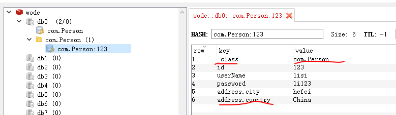

## 引用

[spring data redis](http://projects.spring.io/spring-data-redis/)官网地址

> Spring Data Redis 1.x需要**JDK 6.0**及以上版本，Spring需要**4.2.8.RELEASE**及以上版本，同时Redis也要保证在**2.6.x**或更高的版本。Spring Data Redis还依赖了`commons-logging`，`commons-pool2`以及`jedis`，所以接下来还需要引入jedis的依赖。

- maven依赖:

```xml
<dependencies>
        <dependency>
            <groupId>org.springframework.data</groupId>
            <artifactId>spring-data-redis</artifactId>
            <version>1.7.5.RELEASE</version>
        </dependency>
        <dependency>
            <groupId>redis.clients</groupId>
            <artifactId>jedis</artifactId>
            <version>2.9.0</version>
            <type>jar</type>
            <scope>compile</scope>
        </dependency>
        <dependency>
            <groupId>org.springframework</groupId>
            <artifactId>spring-test</artifactId>
            <version>4.3.4.RELEASE</version>
            <scope>test</scope>
        </dependency>
        <dependency>
            <groupId>junit</groupId>
            <artifactId>junit</artifactId>
            <version>4.12</version>
            <scope>test</scope>
        </dependency>
        <!-- Lombok是通过简单的注解形式来简化消除臃肿的Java代码的工具 -->
        <dependency>
            <groupId>org.projectlombok</groupId>
            <artifactId>lombok</artifactId>
            <version>1.16.8</version>
        </dependency>
        <dependency>
            <groupId>org.slf4j</groupId>
            <artifactId>slf4j-log4j12</artifactId>
            <version>1.7.21</version>
        </dependency>
        <!-- spring使用的json工具 -->
        <dependency>
            <groupId>com.fasterxml.jackson.core</groupId>
            <artifactId>jackson-databind</artifactId>
            <version>2.8.4</version>
        </dependency>
        <!-- 超方便的对象与json互转工具，阿里精品 -->
        <dependency>
            <groupId>com.alibaba</groupId>
            <artifactId>fastjson</artifactId>
            <version>1.2.22</version>
        </dependency>
    </dependencies>
```

- 完整目录结构：


---

## 基本配置和使用

- spring配置文件：

```xml
<?xml version="1.0" encoding="UTF-8"?>
<beans xmlns="http://www.springframework.org/schema/beans"
       xmlns:xsi="http://www.w3.org/2001/XMLSchema-instance"
       xmlns:p="http://www.springframework.org/schema/p"
       xmlns:context="http://www.springframework.org/schema/context"
       xsi:schemaLocation="http://www.springframework.org/schema/beans
       http://www.springframework.org/schema/beans/spring-beans.xsd
       http://www.springframework.org/schema/context
       http://www.springframework.org/schema/context/spring-context.xsd">
    <!-- 注解扫描 -->
    <!-- <context:component-scan base-package="com"/> -->
    <!-- 连接工厂，可以添加连接池配置 -->
    <bean id="jedisConnFactory" class="org.springframework.data.redis.connection.jedis.JedisConnectionFactory"
          p:hostName="localhost" p:port="6379"/>

    <bean id="redisTemplate" class="org.springframework.data.redis.core.RedisTemplate"
          p:connectionFactory-ref="jedisConnFactory"/>
</beans>
```

> 注解扫描为后面的Repositories准备的，前面的暂时用不到。

- 基本使用测试：

``` java
import com.Person;
import lombok.extern.slf4j.Slf4j;
import org.junit.Test;
import org.junit.runner.RunWith;
import org.springframework.beans.factory.annotation.Autowired;
import org.springframework.data.redis.core.RedisTemplate;
import org.springframework.test.context.ContextConfiguration;
import org.springframework.test.context.junit4.SpringJUnit4ClassRunner;

import java.util.ArrayList;
import java.util.Arrays;
import java.util.List;

@Slf4j
@RunWith(SpringJUnit4ClassRunner.class)
@ContextConfiguration(locations = "classpath:redisTest.xml")
public class RedisTest {

    @Autowired
    private RedisTemplate<String,String> redisTemplate;
    @Test
    public void test() {
        redisTemplate.opsForValue().set("123","abc");
        String a=redisTemplate.opsForValue().get("123");
        log.info("123:{}",a);
    }
```

- 结果：
- redis里数据：

> 上图看出redis里存的数据为序列化的数据，不利于阅读。

### 常用API

| Interface              | Description                              |
| ---------------------- | ---------------------------------------- |
| *Key Type Operations*  |                                          |
| ValueOperations        | Redis string (or value) operations(简单K-V操作) |
| ListOperations         | Redis list operations(list类型的数据操作,消息队列)  |
| SetOperations          | Redis set operations(set类型数据操作)          |
| ZSetOperations         | Redis zset (or sorted set) operations(带权重的set) |
| HashOperations         | Redis hash operations(类似map)             |
| HyperLogLogOperations  | Redis HyperLogLog operations like (pfadd, pfcount,…​) |
| *Key Bound Operations* |                                          |
| BoundValueOperations   | Redis string (or value) key bound operations |
| BoundListOperations    | Redis list key bound operations          |
| BoundSetOperations     | Redis set key bound operations           |
| BoundZSetOperations    | Redis zset (or sorted set) key bound operations |
| BoundHashOperations    | Redis hash key bound operations          |

- ValueOperations与BoundValueOperations的区别

```java
    @Test
    public void test() {
        ValueOperations<String, String> valueOps=redisTemplate.opsForValue();
        valueOps.set("123","abc");
        valueOps.set("234","bcd");

        BoundValueOperations<String, String> boundValueOps=redisTemplate.boundValueOps("456");
        boundValueOps.set("cde");
    }
```

> 由上图可以看出，区别是**ValueOperations**是相当与建立连接，**BoundValueOperations**是建立某个key的连接，相当于与key绑定，专门操作这个key。

### 序列化的使用(RedisSerializer)

RedisTemplate默认使用**JdkSerializationRedisSerializer**进行序列化。

| spring data redis提供常用的序列化：         |              |
| ---------------------------------- | ------------ |
| StringRedisSerializer              | String类型的序列化 |
| JdkSerializationRedisSerializer    | 默认           |
| Jackson2JsonRedisSerializer        | 对象序列化成JSON   |
| GenericJackson2JsonRedisSerializer | 同上，区别下面会说    |

- StringRedisSerializer

> 由上面的运行结果可以看出默认的序列化存入redis的数据不容易阅读，所以我们使用**StringRedisSerializer**解决。

1. 方案一：修改配置文件

```xml
    <bean id="stringRedisSerializer" class="org.springframework.data.redis.serializer.StringRedisSerializer"/>

    <bean id="redisTemplate" class="org.springframework.data.redis.core.RedisTemplate"
          p:connectionFactory-ref="jedisConnFactory"
          p:keySerializer-ref="stringRedisSerializer"
          p:valueSerializer-ref="stringRedisSerializer"/>
```

2. 方案二：

```java
    @Test
    public void test() {
        redisTemplate.setKeySerializer(new StringRedisSerializer());
        redisTemplate.setValueSerializer(new StringRedisSerializer());
        redisTemplate.opsForValue().set("123","abc");
        String a=redisTemplate.opsForValue().get("123");
        log.info("123:{}",a);
    }
```

- 结果：

> 上图也可以看出生成了2个**key**，已经不是同一个**key**。

### StringRedisTemplate

如果程序只操作String类型，可以使用`StringRedisTemplate`，采用`StringRedisSerializer`序列化

- 配置：redisTemplate替换为stringRedisTemplate

```xml
    <bean id="stringRedisTemplate" class="org.springframework.data.redis.core.StringRedisTemplate"
          <!--p:connectionFactory-ref="jedisConnFactory"/>
```

- 测试：

```java
    @Autowired
    private StringRedisTemplate redisTemplate;
    @Test
    public void test() {
        redisTemplate.opsForValue().set("123","abc");
        String a=redisTemplate.opsForValue().get("123");
        log.info("123:{}",a);
    }
```

> 如果要操作对象可以序列化为JSON数据来存储，推荐使用阿里的fastjson。

```java
String str= JSON.toJSONString(list);
List<Person> list1=JSON.parseArray(str,Person.class);
```

> 更多操作：[fastjson](https://github.com/alibaba/fastjson/wiki)

### JAVA对象的操作

> **不要试图使用泛型Java集合，例如`RedisTemplate<Key,Collection<?>>`，这种用法等价于在jvm把`Collection<?>`序列化成字节数组，以value的形式保存到redis中，很显然，这种方法非常低效，不仅存在大量的序列化反序列化操作，并且每次操作集合都要首先获取一个完整的集合（包含所有的元素）。正确的方法是使用redis提供的集合类型，例如List，Set，ZSet（Sorted Set）和Map。**

1. 使用fastjson转为String类型的json数据通过`StringRedisTemplate`来存储，同样获取数据后再转换成对象。此种方式可以解决上面既要使用Java集合又不想使用redis的集合类型。

> StringRedisTemplate只能操作String类型，不能操作其他类型数据。

2. 使用默认的`RedisTemplate` 和`JdkSerializationRedisSerializer`来操作对象。

> 使用JdkSerializationRedisSerializer需要对象类实现`Serializable`。

- Person类：

```java
package com;

import lombok.Data;
import lombok.NoArgsConstructor;
import lombok.AllArgsConstructor;

import java.io.Serializable;

@Data
@NoArgsConstructor
@AllArgsConstructor
public class Person implements Serializable {
    private static final long serialVersionUID = 4039894148877123115L;
    private String id;
    private String userName;
    private String password;
}
```

- 修改redisTemplate配置：

```xml
    <bean id="redisTemplate" class="org.springframework.data.redis.core.RedisTemplate"
          p:connectionFactory-ref="jedisConnFactory"
          p:keySerializer-ref="stringRedisSerializer"/>
```

- 测试：

```java
    @Autowired
    private RedisTemplate<String,Person> redisTemplate;
    @Test
    public void test() {
        Person p=new Person("123","lisi","li123");
        redisTemplate.opsForValue().set("123",p);
        p=redisTemplate.opsForValue().get("123");
        log.info("123:{}",p);
    }
```

> 缺点：redis数据库数据可视化差。

3. 使用`RedisTemplate` 和`Jackson2JsonRedisSerializer`来操作对象。

- 同样使用上面配置，修改测试方法：

```java
    @Autowired
    private RedisTemplate<String,Person> redisTemplate;
    @Test
    public void test() {
        redisTemplate.setValueSerializer(new Jackson2JsonRedisSerializer<Person>(Person.class));
        Person p=new Person("123","lisi","li123");
        redisTemplate.opsForValue().set("123",p);
        p=redisTemplate.opsForValue().get("123");
        log.info("123:{}",p);
    }
```

> 多个方法使用时可以考虑初始化：

```java
    private RedisTemplate<String,Person> redisTemplate;

    @Autowired
    public RedisTest(RedisTemplate<String, Person> redisTemplate) {
        this.redisTemplate = redisTemplate;
        redisTemplate.setValueSerializer(new Jackson2JsonRedisSerializer<Person>(Person.class));
    }
```

4. 使用`RedisTemplate` 和`GenericJackson2JsonRedisSerializer`来操作对象。

> 这个方法可以像StringRedisSerializer一样在配置文件里配置：

- 配置文件修改：

```xml
    <bean id="jsonRedisSerializer" class="org.springframework.data.redis.serializer.GenericJackson2JsonRedisSerializer"/>

    <bean id="redisTemplate" class="org.springframework.data.redis.core.RedisTemplate"
          p:connectionFactory-ref="jedisConnFactory"
          p:keySerializer-ref="stringRedisSerializer"
          p:valueSerializer-ref="jsonRedisSerializer"/>
```

- 测试：

```java
    @Autowired
    private RedisTemplate<String,Person> redisTemplate;
    @Test
    public void test() {
        Person p=new Person("123","lisi","li123");
        redisTemplate.opsForValue().set("123",p);
        p=redisTemplate.opsForValue().get("123");
        log.info("123:{}",p);
    }
```

> 总结：推荐使用第4种方法操作对象，方便直接。当然也可以使用第1种，转换成JSON String进行存储。其实后2种本质上还是第1种。如果要存储对象集合，请使用第1种方法，原因开头有写。以上策略封装和编程都较为复杂，性能也存在一些问题，在当前版本中我们有更好的选择，Spring Data Redis在最新版1.7.x中为我们提供了**Redis Repositories**，可以无缝的转换并存储领域对象，使用的数据类型为哈希（hash）。

### Callback

//todo 以后再写，感觉用处不大，其实也就是调用`RedisConnection`来直接操作数据或数据库。

### 消息

//todo 没搞懂呢。

### 事务

支持@Transactional，慢慢研究。

### 缓存

Support for Spring Cache Abstraction

### 集群

```java
List<String> nodes = new ArrayList<String>(Arrays.asList("127.0.0.1:7379", "127.0.0.1:7380"));
RedisConnectionFactory connectionFactory = new JedisConnectionFactory(new RedisClusterConfiguration(nodes));
```

## Redis Repositories

在Spring Data Redis1.7的新特性中，除了支持Redis集群外，我们还可以看到另一条重要的新特性——Redis Repositories允许通过redis的hash类型无缝的存储以及转换领域对象，应用了自定义的映射策略并且利用了二级索引。接下来具体看一下用法，还需要注意一下如果要使用Redis Repositories，那么redis服务器的版本不能低于2.8.0。

### 基础用法

- 首先是在我们的实体bean上添加注解`@RedisHash`，并且在标识属性（或主键）上添加`@Id`注解，这两个注解负责创建用于存储对象hash的key，例如：

```java
package com;

import lombok.Data;
import lombok.NoArgsConstructor;
import lombok.AllArgsConstructor;
import org.springframework.data.annotation.Id;
import org.springframework.data.redis.core.RedisHash;

import java.io.Serializable;

@Data
@NoArgsConstructor
@RedisHash
public class Person implements Serializable {
    private static final long serialVersionUID = 4039894148877123115L;
    @Id
    private String id;
    private String userName;
    private String password;
    private Address address;
    public Person(String id, String userName, String password) {
        this.id = id;
        this.userName = userName;
        this.password = password;
    }
}
```

```java
package com;

import lombok.AllArgsConstructor;
import lombok.Data;
import lombok.NoArgsConstructor;

@Data
@NoArgsConstructor
@AllArgsConstructor
public class Address  {
    private String city;
    private String country;
}
```

> 这里注意`@NoArgsConstructor`的使用，生成无参构造方法，没有无参构造方法无法转换数据成对象。

- 第二步需要创建一个repository接口来存取数据，继承`CrudRepository`。

```java
package com;

import org.springframework.data.repository.CrudRepository;

public interface PersonRepository extends CrudRepository<Person,String> {
}
```

- 添加一个配置类（可以去掉直接配置在Person类里）

```java
package com;

import org.springframework.data.redis.repository.configuration.EnableRedisRepositories;
import org.springframework.stereotype.Component;

@Component
@EnableRedisRepositories
public class AppConfig  {}
```

> 关键点就是`@EnableRedisRepositories`，该注解表示启用Repositories，就可以使用CrudRepository`为我们提供的一组基础的CRUD方法了。
>
> 当然你也可以把`@EnableRedisRepositories`注解放在Person类里，或其他类里（只需要一个地方），注意用`@Component`添加到配置里。
>
> 重要:这个`AppConfig`要和`PersonRepository`放在同一个目录下,不然不能加载`PersonRepository`.

- 配置信息：

```xml
    <context:component-scan base-package="com"/>

    <bean id="jedisConnFactory" class="org.springframework.data.redis.connection.jedis.JedisConnectionFactory"
          p:hostName="localhost" p:port="6379"/>

    <bean id="redisTemplate" class="org.springframework.data.redis.core.RedisTemplate"
          p:connectionFactory-ref="jedisConnFactory"/>
```

> context配置主要用于扫描`@EnableRedisRepositories`和`PersonRepository`。

- 测试：

```java
    @Autowired
    private PersonRepository repository;

    @Test
    public void test() {
        Person p=new Person("123","lisi","li123");
        p.setAddress(new Address("hefei","China"));
        repository.save(p);
        p=repository.findOne(p.getId());
        log.info("123:{}",p);
    }
```

- 结果：



> 补充：上面的通过Jackson2JsonRedisSerializer或GenericJackson2JsonRedisSerializer来保存对象还有一个区别：前者redis保存的数据不带`_class`值，后者redis保存的数据与上图相似带`_class`，里面保存类的全路径。这就解释了它不需要`Person.class`。

### 对象哈希映射

Redis Repository支持通过hash类型持久化对象。实际上是通过一个RedisConverter（转换器）来实现的，这个转换器的默认实现就是`org.springframework.core.convert.converter.Converter`，在上图的结果映射列表中，id、userName、password映射属性属于Simple Type，address属于Complex Type，官方文档中给出了一张默认的映射规则表： 

| Type                       | Sample                                   | Mapped Value                             |
| -------------------------- | ---------------------------------------- | ---------------------------------------- |
| Simple Type (eg. String)   | String firstname = "rand";               | firstname = "rand"                       |
| Complex Type (eg. Address) | Address adress = new Address("emond’s field"); | address.city = "emond’s field"           |
| List of Simple Type        | List<String> nicknames = asList("dragon reborn", "lews therin"); | nicknames.[0] = "dragon reborn", nicknames.[1] = "lews therin" |
| Map of Simple Type         | Map<String, String> atts = asMap({"eye-color", "grey"}, {"… | atts.[eye-color] = "grey", atts.[hair-color] = "…​ |
| List of Complex Type       | List<Address> addresses = asList(new Address("em…​ | addresses.[0].city = "emond’s field", addresses.[1].city = "…​ |
| Map of Complex Type        | Map<String, Address> addresses = asMap({"home", new Address("em…​ | addresses.[home].city = "emond’s field", addresses.[work].city = "… |

> 每种映射类型都提供了对应的例子，当然这都是官方默认提供的，我们还可以通过程序自定义，个人感觉不推荐，有需求的朋友（比如保存为json格式等）可以参考官方文档，实现`Converter`。

### Keyspaces

keyspace用于创建hash键的前缀，默认的前缀是`getClass().getName()`即全类名，这里的默认意思就是说当我们的@RedisHash注解没有指定参数时，默认会用全类名做为前缀： 如上图结果里显示的`com.Person:123`。

修改为：`@RedisHash("persons")`则保存的key的名称为`persons:123`.

> 补：上图结果redis数据可视化工具显示有一个`com.Person`的key为set类型数据，里面存的是id的值，我估计是用来finall()或者count()等用的。同时还有一个`com.Person`的文件夹，这是因为redis把`:`理解为文件夹分割符一样，比如`@RedisHash("persons:test")`保存的数据显示为`persons`文件夹下还有`test`文件夹里面有一个`persons:test:123`key。——所以推荐key的命名方式为`项目名称:对象名:ID`,例如`redisTest:persons:123`，添加项目名称方便管理。

keyspace支持自定义，需要继承`KeyspaceConfiguration`。不推荐可以参考官方文档。

### 二级索引

二级索引（Secondary Indexes）实现需要`@Indexed` `org.springframework.data.redis.core.index.Indexed;`，示例：

```java
    @Indexed
    private String userName;
```

根据userName创建索引，例如：创建`persons:userName:lisi`key的set类型数据，里面保存那些叫lisi的id的值。这个可以配合后面的查询，比如查询userName叫lisi的人有哪些：

```java
List<Person> findByUserName(String userName);
```

可以给多个属性设置二级索引，实现多条件查询等。同样支持自定义配置，参考官方文档.

### 对象过期时间

支持设置保存对象的过期时间（Time To Live），-1为永久生效。

> RedisTemplate同样有设置过期时间的方法：（下面表示10秒过期，`TimeUnit.MINUTES`为分钟等...）

```java
redisTemplate.opsForValue().set("123","abc",10L, TimeUnit.SECONDS);
```

1. 方法一：修改`@RedisHash`改为`@RedisHash(value = "persons", timeToLive = 60L)`

> 只能设置秒数。上面的60L表示60秒。

2. 方法二：添加一个Long类型的属性。(名称随意)

```java
  @TimeToLive
  private Long expiration;
```

> 好处是：可以设置时间类型如`@TimeToLive(unit = TimeUnit.MINUTES)`，同时可以在对象数据初始化时赋值过期时间，当然也可以直接给死时间，`private final Long expiration = 10L;`。
>
> 坏处是：保存的redis数据里多了一个属性。

3. 方法三：添加一个方法返回值是long类型。(方法名随意)

```java
  @TimeToLive
  public long getTimeToLive() {
  	return new Random().nextLong();	//return 60L;
  }
```

> 好处是：同样支持`@TimeToLive(unit = TimeUnit.MINUTES)`，可以给死值，redis数据没有多余属性。
>
> 坏处是：不能初始化时修改过期时间。


> 上图的TTL:58为剩余时间，单位为秒。上面3种方法同时还创建了一个`persons:123:phantom`的key，这个key保存时间比`persons:123`多300s，相当于一个备份有300秒的反悔时间，还没发现怎么用的。
>
> 补：`persons:123:idx`为二级索引，里面保存的值为`persons:userName:lisi`，对应的userName文件夹保存的是二级索引包含的对象ID，值为123、456，表示id为123和456的都叫lisi。二级索引是没有过期时间的。

### 查询

查询与索引配合使用，支持分页查询，示例：

```java
public interface PersonRepository extends CrudRepository<Person, String> {
  List<Person> findByFirstname(String firstname);
}
```

直接在测试方法里获取就可以了，不用实现上面的接口和方法。

```java
    @Test
    public void test() {
        Person p1=new Person("123","lisi","li123");
        Person p2=new Person("456","lisi","li1234");
        p1.setAddress(new Address("hefei","China"));
        p2.setAddress(new Address("shanghai","China"));
        repository.save(p1);
        repository.save(p2);
        List<Person> list=repository.findByUserName("lisi");
        log.info("123:{}",list);
    }
```

支持的方法：

| Keyword   | Sample                                   | Redis snippet                            |
| --------- | ---------------------------------------- | ---------------------------------------- |
| And       | findByLastnameAndFirstname               | SINTER …:firstname:rand …:lastname:al’thor |
| Or        | findByLastnameOrFirstname                | SUNION …:firstname:rand …:lastname:al’thor |
| Is,Equals | findByFirstname,findByFirstnameIs,findByFirstnameEquals | SINTER …:firstname:rand                  |
| Top,First | findFirst10ByFirstname,findTop5ByFirstname |                                          |

同时可以通过`RedisCallback`操作索引查询，获取ID集合或值，不知道有什么意义。

> Redis Repositories支持集群Cluster，配置`ConnectionFactory`即可。
>
> 还有个CDI，不知道什么东东。

## 附录

### RedisTemplet常用方法

| RedisTemplet常用方法                         |                        |
| ---------------------------------------- | ---------------------- |
| ValueOperations<K, V> opsForValue = redisTemplate.opsForValue(); | **String类型，key-value** |
| `void set(K var1, V var2);`              | 保存                     |
| `void set(K var1, V var2, long var3);`   | 保存，带过期时间/秒             |
| `void set(K var1, V var2, long var3, TimeUnit var5);` | 保存，过期时间/可设时间单位         |
| `V get(Object var1);`                    | 获取                     |
| ListOperations<K, V> opsForList = redisTemplate.opsForList(); | **List类型，存在插入顺序**      |
| `Long leftPush(K var1, V var2);`         | 从左边存入                  |
| `Long leftPushAll(K var1, V... var2);`   | 从左边存入多个                |
| `Long leftPushAll(K var1, Collection<V> var2);` | 从左边存入集合                |
| `V leftPop(K var1);`                     | 从左边取出（取出就没有了）          |
| `Long rightPush(K var1, V var2);`        | 从右边存入                  |
| SetOperations<K, V> opsForSet = redisTemplate.opsForSet(); | **Set类型**              |
| `Long add(K var1, V... var2);`           | 添加                     |
| `Set<V> members(K var1);`                | 获取Set集合                |
| `Boolean isMember(K var1, Object var2);` | 判断是不是集合里的元素            |
| `Set<V> intersect(K var1, K var2);`      | 获取2个Set集合的交集           |
| `Set<V> difference(K var1, K var2);`     | 获取2个Set集合的补集           |
| `Set<V> union(K var1, K var2);`          | 获取2个Set集合的并集           |
| ZSetOperations<K, V> opsForZSet = redisTemplate.opsForZSet(); | **Set类型，带权重信息**        |
|                                          |                        |
| HashOperations<H, HK, HV> opsForHash = redisTemplate.opsForHash(); | **Hash类型**             |
| `void put(H var1, HK var2, HV var3);`    | 保存                     |
| `void putAll(H var1, Map<? extends HK, ? extends HV> var2);` | 保存Map                  |
| `HV get(H var1, Object var2);`           | 获取键的值                  |
| `Set<HK> keys(H var1);`                  | 获取所有的键                 |
| `List<HV> values(H var1);`               | 获取所有的值                 |